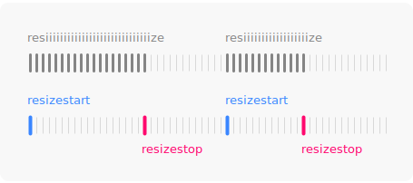

# resizestart & resizestop events

[](https://www.npmjs.com/package/resize-start-stop)
[](https://bundlephobia.com/result?p=resize-start-stop)
[](./LICENSE)


Debounced resize events: know when a user started or stopped resizing the window.

## Why would I need this?



The window's `resize` event is triggered continously and often. That's bad news
for performance. In most cases, what we really want to know is when the user has started or stopped resizing the window.

## What does it do?

This package will trigger debounced resize events on the window. Simply replace
your old `resize` event listeners with more performant `resizestart` and
`resizestop` listeners.

## Installation

```bash
npm install resize-start-stop
```

## Usage

Import and call `bindResizeEvents()` to install debounced `resizestart` and
`resizestop` events on the window.

```js
import { bindResizeEvents } from 'resize-start-stop'

bindResizeEvents()

window.addEventListener('resizestart', () => { console.log('Resizing') })
window.addEventListener('resizestop', () => { console.log('Resized') })
```

### Toggle class name during resize

The package includes a helper for the most common use case: toggling a class
name on the `html` element during resize. Great for disabling transitions
and animations while crossing breakpoint boundaries.

```js
import { toggleClassDuringResize } from 'resize-start-stop'

toggleClassDuringResize()
```

```css
html.is-resizing * {
  transition: none !important;
}
```

All options and their defaults:

```js
toggleClassDuringResize({
  className: 'is-resizing',
  element: document.documentElement,
  wait: 200
})
```

### Cleaning up

If you don't need the installed events anymore, import and call
`unbindResizeEvents()`.

```js
import { bindResizeEvents, unbindResizeEvents } from 'resize-start-stop'

// Bind events
bindResizeEvents()

// Unbind at later stage
unbindResizeEvents()
```

### In the browser

If you don't have the luxury of using a bundler, you can also
simply include the script tag and call it a day.

```html
<script src="https://unpkg.com/resize-start-stop"></script>
<script>
  resizeStartStop.bindResizeEvents()
</script>
```

## License

[MIT](https://opensource.org/licenses/MIT)
